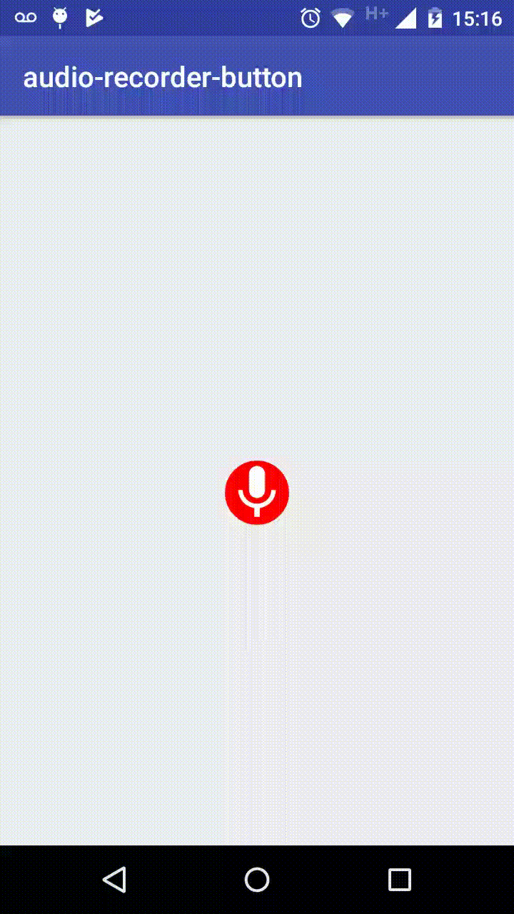

# Safety Audio Recorder Button
Simple audio recorder component for android

## Demo
<p align="center">
  
</p>


### Add permissions in your androidmanifest.xml
```xml
<uses-permission android:name="android.permission.RECORD_AUDIO" />
<uses-permission android:name="android.permission.READ_EXTERNAL_STORAGE" />
<uses-permission android:name="android.permission.WRITE_EXTERNAL_STORAGE"/>
```

## Install
Add the dependecy

```gradle
allprojects {
    repositories {
        ...
        maven { url 'https://jitpack.io' }
    }
}

dependencies {
    compile 'com.github.safetysystemtechnology:audio-recorder-button:v1.3'
}

```
## Usage

### XML

```xml
<br.com.safety.audio_recorder.AudioRecordButton
  android:id="@+id/audio_record_button"
  android:layout_centerInParent="true"
  android:layout_width="150dp"
  android:layout_height="80dp" />
```
### Configure XML

* recorder_image_size: size to image micro voice
* remove_image_size: size to image cancel audio
* recorder_image: drawable to image voice
* remove_image: drawable to image voice
* remove_position: left or right (Todo)

### Java

```java

private AudioRecordButton audioRecordButton;

audioRecordButton = (AudioRecordButton) findViewById(R.id.audio_record_button);
```

Starting audio record

```java
audioRecordButton.setOnAudioListener(new AudioListener() {
            @Override
            public void onStop(RecordingItem recordingItem) {
                Toast.makeText(getBaseContext(), "Audio...", Toast.LENGTH_SHORT).show();
            }

            @Override
            public void onCancel() {
                Toast.makeText(getBaseContext(), "Cancel", Toast.LENGTH_SHORT).show();
            }

            @Override
            public void onError(Exception e) {
                Log.d("MainActivity", "Error: " + e.getMessage());
            }
        });
```

If you prefer to execute the sound after the audio capture, just call the `play()` method inside `onStop()`

```java
@Override
public void onStop(RecordingItem recordingItem) {
    Toast.makeText(getBaseContext(), "Audio...", Toast.LENGTH_SHORT).show();
    new AudioRecording(getBaseContext()).play(recordingItem);
}
```

## License
    The MIT License (MIT)

    Copyright (c) Safety System Technology

    Permission is hereby granted, free of charge, to any person obtaining a
    copy of this software and associated documentation files (the "Software"),
    to deal in the Software without restriction, including without limitation
    the rights to use, copy, modify, merge, publish, distribute, sublicense,
    and/or sell copies of the Software, and to permit persons to whom the Software is
    furnished to do so, subject to the following conditions:

    The above copyright notice and this permission notice shall be included
    in all copies or substantial portions of the Software.

    THE SOFTWARE IS PROVIDED "AS IS", WITHOUT WARRANTY OF ANY KIND, EXPRESS OR IMPLIED,
    INCLUDING BUT NOT LIMITED TO THE WARRANTIES OF MERCHANTABILITY, FITNESS FOR A PARTICULAR
    PURPOSE AND NONINFRINGEMENT. IN NO EVENT SHALL THE AUTHORS OR COPYRIGHT HOLDERS BE LIABLE
    FOR ANY CLAIM, DAMAGES OR OTHER LIABILITY, WHETHER IN AN ACTION OF CONTRACT, TORT OR OTHERWISE,
    ARISING FROM, OUT OF OR IN CONNECTION WITH THE SOFTWARE OR THE USE OR OTHER DEALINGS IN THE SOFTWARE.
